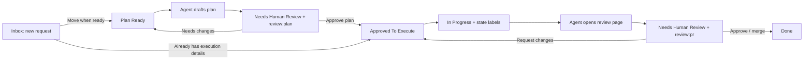
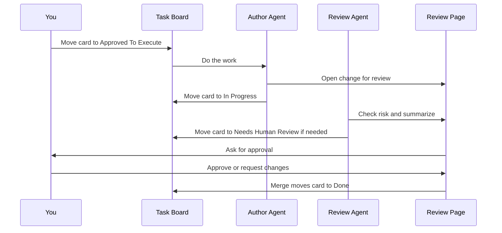
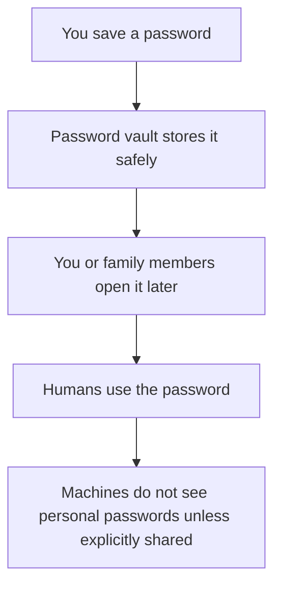
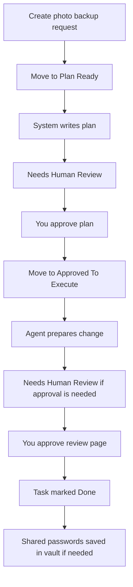

# Human Interfaces Guide

This system has a lot of moving parts behind the scenes, but most people only
need to know a few human-facing places:

1. the task board
2. the review page (Forgejo)
3. the password vault (Vaultwarden)
4. memory and chat (Khoj)
5. executive assistant (operator-facing)

Think of it like this:

- the board is where you ask for something and track it
- the review page is where you approve or reject important changes
- the password vault is where you store and share human passwords safely
- Khoj is where you search what the system remembers and chat with an assistant
  that can use that context
- the executive assistant is where an operator can ask for coordinated work
  across memory, Planka, and the project-agent platform

## Quick links

Use these from the home network:

- Task board: `https://planka.dev-path.org`
- Review page: `https://forgejo.dev-path.org`
- Password vault: `https://vaultwarden.dev-path.org`
- Memory and chat: `https://khoj.dev-path.org`
- Agent dashboard: `https://agents.dev-path.org/?token=<agent-activity-token>`
- Executive assistant chat: `http://192.168.1.45:8767/?token=<executive-chat-token>`

The dashboard is currently exposed through the reverse proxy. The executive
assistant chat runs directly on the Alienware host until a reverse-proxy route is
added. Do not use `https://...:8767`; the first chat service is plain HTTP on
the home network.

## 1. Task board

This is the main everyday interface.

Open it at:

`https://planka.dev-path.org`

Use it for:

- asking the system to do something
- tracking what is in progress
- seeing whether something is waiting on a person
- seeing what was finished

Examples:

- "Add a photo backup system"
- "Fix the movie server buffering problem"
- "Research a good family calendar setup"
- "Set up a shared shopping list"

### What using the board feels like

You create or open a card, add what you want, and move it forward when you want
the system to do the next step.

Simple example:

1. Create a card called `Fix Plex buffering`.
2. Add a short note like: `Videos pause at night. Please investigate.`
3. Move it to `Plan Ready` when you want the agent to draft a plan.
4. The system adds a plan to the card itself (read the card description), adds
   a `review:plan` label, and usually moves the card to `Needs Human Review` so
   you can decide before any repo changes happen.
5. If the plan looks right, move the card to `Approved To Execute`.
6. The agent does the work and opens a review page.
7. The card moves back to `Needs Human Review` if you need to approve the change.
8. When approved and merged, the card usually ends up in `Done`. If the merged
   change was only an approved *plan*, automation may move the card to
   `Approved To Execute` so the next step (actual work) can run without starting
   over.

If you move a card to `Approved To Execute` but there is no clear executable plan
on the card yet, automation may move it back to `Needs Human Review` with a short
explanation so nothing runs by mistake.

Other columns you might see:

- `Blocked`: waiting on an external dependency
- `Rejected`: we decided not to do this

Labels explain what is happening. **Moving a card** to certain columns starts
automation; **only changing labels** does not start work by itself.

Common labels:

- `review:plan`: review the plan before work starts
- `review:pr`: review the change before it is merged
- `review:changes-requested`: something needs fixing before continuing
- `state:author-working`: an agent is actively editing or preparing a change
- `state:pr-open`: a review page exists
- `state:review-agent`: the review agent is checking it
- `state:ready-to-merge`: the review agent thinks it is ready
- `type:docs`, `type:deployment`, `type:research`: what kind of task this is

### Board diagram



The only moves that start work are:

- move to `Plan Ready` to ask for a plan
- move to `Approved To Execute` to ask the agent to do approved work

## 2. Review page

This is the page in Forgejo (self-hosted Git) where you approve important changes
before they go live. Your maintainer sets the exact URL; you sign in with the
Forgejo user and password you were given.

Open it at:

`https://forgejo.dev-path.org`

You do not need to use it for every little thing. It is mainly for:

- changes that could break something
- changes that affect shared family systems
- anything new, sensitive, or unclear

What you will usually see:

- a short title
- a summary of what changed
- why the change was made
- whether the review agent thinks it is safe
- buttons to approve, request changes, or leave comments

Examples:

- approving a new backup schedule
- approving a networking change
- rejecting a change because the plan sounds too disruptive

### Example review

The review page might say:

- `Change: Add nightly backup for family photos`
- `Why: protect photo library from disk failure`
- `Risk: low`
- `Review agent says: safe to merge`

A less technical reviewer can usually just answer:

- "Yes, this is what we wanted"
- "No, this is not what I meant"
- "Wait, explain this first"

### Review diagram



## 3. Password vault

This is where human passwords live.

Open it at:

`https://vaultwarden.dev-path.org`

Use it for:

- personal passwords
- shared family logins
- recovery codes
- important notes like break-glass steps

Do not use it for machine-only tokens or service secrets. Those go into the
machine secret system in the background.

Examples:

- home Wi-Fi password
- streaming service login
- recovery code for a shared account
- notes for how to recover access to something important

### Password vault diagram



## 4. Memory and chat (Khoj)

Khoj is the friendliest place to **explore what the system already knows**.

Open it at:

`https://khoj.dev-path.org`

Use it for:

- searching across notes and documents the household cares about
- asking questions in chat when you want an answer grounded in that material
- seeing whether something was written down already before opening a new task

Your maintainer publishes it behind HTTPS (for example `https://khoj.dev-path.org`
if that is how the home reverse proxy is set up). The chat assistant is wired to
the home **model gateway**, not a single app on one PC, so the exact model name
in menus may change over time; pick the default or “fast” option your maintainer
recommends.

Deeper technical detail lives in the **memory-engine** repository:

- `README.md` — what runs in the stack
- `docs/HYBRID_MEMORY.md` — how database memory, Mem0, and generated notes relate
- `docs/OPERATIONS.md` — URLs, sync, and operator tasks after install

Ingesting brand-new links (YouTube, random web pages) into memory with a formal
“propose then approve” flow is still evolving; the task board is the right place
to ask for that kind of improvement.

## 5. Executive assistant (operator-facing)

The executive assistant is for operators who want to ask for coordinated work
without bypassing the safety rails.

Use it for:

- turning a request into a Planka card with the right labels
- asking for low-risk planning work to start
- checking weekly trends in agent activity and trust
- seeing when the assistant blocked or escalated something

The first conversational interfaces are:

- a local-network web chat on the Alienware host
- an optional Discord bot bridge for direct messages and server channels

Open the local chat at:

`http://192.168.1.45:8767/?token=<executive-chat-token>`

Get the token on the Alienware host:

```bash
ssh kenns@192.168.1.45 \
  'grep EXECUTIVE_CHAT_TOKEN ~/.config/homelab-control/agent-executive-chat.env'
```

The Discord bridge is configured by editing:

`~/.config/homelab-control/agent-executive-discord.env`

Then start it with:

```bash
ssh kenns@192.168.1.45 \
  'cd ~/git/homelab-control && python3 -m pip install --user -r apps/executive_agent/requirements.txt && systemctl --user enable --now alienware-executive-discord.service'
```

The assistant acts as `agent:executive`, not as Kevin, and it cannot approve
sensitive execution on its own.

As the stack grows, the executive assistant is also the router into
project-scoped agents such as `agent:homelab-maintainer`. Those project agents
keep domain-specific trust, routing, and memory boundaries instead of giving one
assistant universal access.

## 6. If something looks stuck (optional)

Household **operators** can check whether agent queues and timers are healthy.
That usually means the **Agent Activity** dashboard plus a status file on the
agent machine described in `docs/AGENT_PLATFORM_OBSERVABILITY.md`. You do not
need this for day-to-day use.

Open it at:

`https://agents.dev-path.org/?token=<agent-activity-token>`

Get the token on the Alienware host:

```bash
ssh kenns@192.168.1.45 \
  'grep AGENT_ACTIVITY_TOKEN ~/.config/homelab-control/agent-activity.env'
```

The dashboard shows queue health, service controls, weekly executive-assistant
review output, recent trust decisions, and recent interaction sources. If trust
information is missing, the deployed dashboard service likely needs to be pulled
and restarted from the latest `homelab-control` checkout.

## A simple household example

Here is what it might look like to use the system without needing to know the
technical details.

### Example: "Set up better backups for family photos"

1. Create a card on the task board.
2. Move it to `Plan Ready`.
3. The system writes a simple plan on the card and moves it to
   `Needs Human Review` for you to read.
4. You read the plan on the card while it sits in `Needs Human Review`.
5. You move it to `Approved To Execute`.
6. The agent prepares the change.
7. If it is important, you get a review page with a summary.
8. You approve it.
9. The task is marked `Done`.
10. If the new setup needs a shared password, that password is stored in the
   password vault.



## What most people should remember

- Start on the task board.
- Use the review page when the system asks for approval.
- Use the password vault for human passwords.
- Use Khoj when you want to read or ask about what is already remembered.

Everything else is mostly there so the system can do safe work in the
background.
