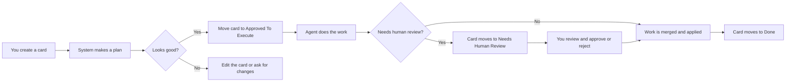
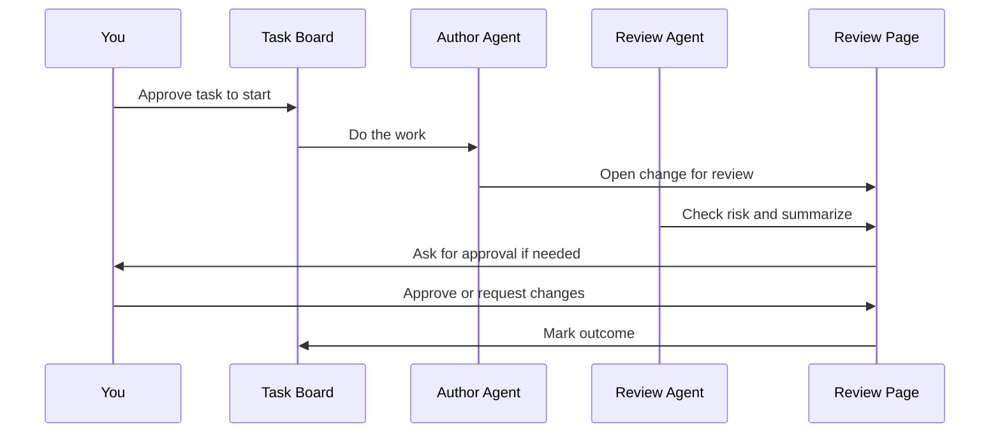
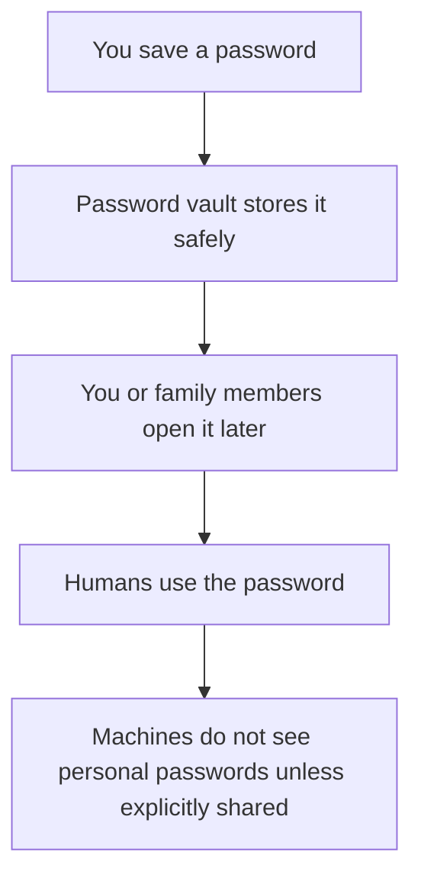
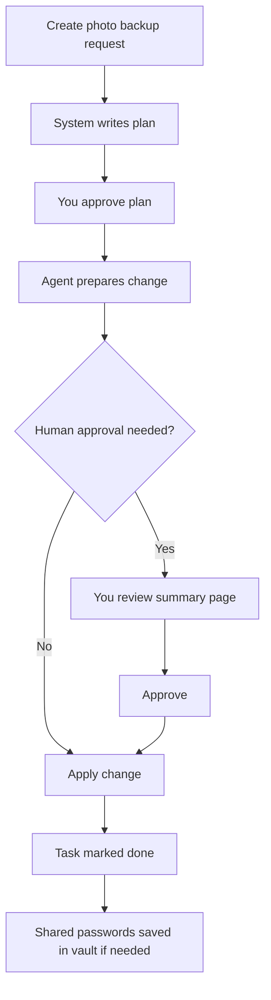

# Human Interfaces Guide

This system has a lot of moving parts behind the scenes, but most people only
need to know three human-facing places:

1. the task board
2. the review page
3. the password vault

Think of it like this:

- the board is where you ask for something and track it
- the review page is where you approve or reject important changes
- the password vault is where you store and share human passwords safely

## 1. Task board

This is the main everyday interface.

Use it for:

- asking the system to do something
- tracking what is in progress
- seeing whether something is waiting on a person
- seeing what was finished

Examples:

- "Add a photo backup system"
- "Fix the movie server buffering problem"
- "Research a good family calendar setup"
- "Set up a shared shopping list"

### What using the board feels like

You create or open a card, read the short plan, and move it forward when you
want work to start.

Simple example:

1. Create a card called `Fix Plex buffering`.
2. Add a short note like: `Videos pause at night. Please investigate.`
3. The system makes a plan.
4. If the plan looks right, move the card to `Approved To Execute`.
5. Later, if the work is risky or important, the card may move to
   `Needs Human Review`.
6. When approved and finished, the card ends up in `Done`.

### Board diagram

## 2. Review page

This is the interface for approving important changes before they go live.

You do not need to use it for every little thing. It is mainly for:

- changes that could break something
- changes that affect shared family systems
- anything new, sensitive, or unclear

What you will usually see:

- a short title
- a summary of what changed
- why the change was made
- whether the review agent thinks it is safe
- buttons to approve, request changes, or leave comments

Examples:

- approving a new backup schedule
- approving a networking change
- rejecting a change because the plan sounds too disruptive

### Example review

The review page might say:

- `Change: Add nightly backup for family photos`
- `Why: protect photo library from disk failure`
- `Risk: low`
- `Review agent says: safe to merge`

A less technical reviewer can usually just answer:

- "Yes, this is what we wanted"
- "No, this is not what I meant"
- "Wait, explain this first"

### Review diagram

## 3. Password vault

This is where human passwords live.

Use it for:

- personal passwords
- shared family logins
- recovery codes
- important notes like break-glass steps

Do not use it for machine-only tokens or service secrets. Those go into the
machine secret system in the background.

Examples:

- home Wi-Fi password
- streaming service login
- recovery code for a shared account
- notes for how to recover access to something important

### Password vault diagram

## A simple household example

Here is what it might look like to use the system without needing to know the
technical details.

### Example: "Set up better backups for family photos"

1. Create a card on the task board.
2. The system writes a simple plan.
3. You check the plan and approve it.
4. The agent prepares the change.
5. If it is important, you get a review page with a summary.
6. You approve it.
7. The task is marked done.
8. If the new setup needs a shared password, that password is stored in the
   password vault.

## What most people should remember

- Start on the task board.
- Use the review page when the system asks for approval.
- Use the password vault for human passwords.

Everything else is mostly there so the system can do safe work in the
background.
