# Planka Automation

Planka is the control plane. Cards are the durable work items that tie together:

- plan/checklist
- repo / environment
- PR or MR
- review decision
- human escalation

## Required card metadata

- domain
- repo
- risk markers
- link to plan
- link to PR/MR once opened

## Trigger model

- `Plan Ready` -> author agent expands plan
- `Approved To Execute` -> author agent works on branch
- `Needs Human Review` -> Kevin reviews plan, PR, or requested changes
- `Done` -> work is complete

Columns trigger work. Labels explain state, type, risk, and why human review is
needed. Manual label changes should not enqueue work.

Current human-facing columns:

- `Inbox`: raw requests and ideas
- `Plan Ready`: request is ready for agent planning
- `Approved To Execute`: plan or execution block is approved for agent work
- `In Progress`: background agent work is underway
- `Needs Human Review`: Kevin needs to approve, reject, or request changes
- `Blocked`: work cannot proceed
- `Done`: complete
- `Rejected`: intentionally declined

Review/state labels:

- `review:plan`
- `review:pr`
- `review:changes-requested`
- `state:author-working`
- `state:pr-open`
- `state:review-agent`
- `state:ready-to-merge`

Type labels:

- `type:docs`
- `type:deployment`
- `type:research`

Risk labels such as `sensitive`, `new_capability`, `auth-change`, and
`network-exposure` affect review policy but do not start work by themselves.

## Flow diagram

```mermaid
flowchart LR
    Inbox[Inbox] -->|Human moves card| Plan[Plan Ready]
    Plan -->|Planning agent drafts plan| ReviewPlan[Needs Human Review<br/>review:plan]
    ReviewPlan -->|Human approves plan| Execute[Approved To Execute]
    ReviewPlan -->|Human requests plan changes| Plan
    Inbox -->|Card already has agent-execution| Execute
    Execute -->|n8n + dispatcher enqueue author job| Progress[In Progress<br/>state:pr-open<br/>state:review-agent]
    Progress -->|Review agent completes| ReviewPR[Needs Human Review<br/>review:pr]
    ReviewPR -->|Agent says ready| Ready[Needs Human Review<br/>state:ready-to-merge]
    ReviewPR -->|Changes requested| Execute
    Ready -->|Human merges PR| Done[Done]
    ReviewPR -->|Human rejects| Rejected[Rejected]
```



The board is intentionally human-oriented. Internal queue states live in the
agent platform status report, not as extra Planka columns.

## Queue dispatch

The repo now includes a small bridge from card exports to queue jobs:

```bash
python3 scripts/planka_dispatch.py \
  --card /path/to/card.json \
  --author-queue ~/.local/state/homelab-control/agent-homelab \
  --review-queue ~/.local/state/homelab-control/agent-review \
  --artifact-dir ~/.local/state/homelab-control/planka-artifacts
```

Expected mappings:

- `Plan Ready` -> enqueue `create-execution-job`
- `Approved To Execute` -> enqueue `execute-task`
- `Needs Human Review` -> no automatic execution; this is a human checkpoint

The card JSON should carry enough metadata to preserve linkage between:

- card ID
- plan link
- Planka URL
- branch name
- PR URL
- review context path

The generated queue job file name should include the Planka card ID so later
receipts and PR artifacts remain traceable.

## Live webhook dispatcher

The Alienware agent host also runs an HTTP dispatcher for n8n:

- `POST http://<alienware>:8765/planka-control-plane`
- `POST http://<alienware>:8765/planka/card-moved`
- `POST http://<alienware>:8765/forgejo/pull-request`

Requests should include:

```http
X-Agent-Dispatch-Token: <shared secret>
```

For execution, a Planka card moved to `Approved To Execute` should include a
fenced JSON block in its description:

````markdown
```agent-execution
{
  "allowed_paths": ["docs"],
  "checks": ["git diff --check"],
  "operations": {
    "write_files": [
      {
        "path": "docs/example.md",
        "content": "hello\n"
      }
    ]
  },
  "review_queue_dir": "/home/kenns/.local/state/homelab-control/agent-review"
}
```
````

When Forgejo reports a merged PR, the dispatcher moves the related Planka card:

- default: `Done`
- if the PR body contains `Next Planka list: Approved To Execute`: `Approved To Execute`

This supports both flows:

- normal implementation PR merged -> card is done
- plan/scaffold PR merged -> card can move back to `Approved To Execute` for the
  next execution step

## Live smoke test

A real Planka card can be moved to `Approved To Execute` to enqueue an author-agent job through n8n and the Alienware dispatcher. The matching Forgejo merge webhook moves the linked card to `Done`.

## Lifecycle callbacks

The author and review agents call back to the event dispatcher as work
progresses:

- author opens PR -> card moves to `In Progress` and gets `state:pr-open` +
  `state:review-agent`
- review requests human approval -> card moves to `Needs Human Review` with
  `review:pr`
- review says it is merge-ready -> card stays in `Needs Human Review` and gets
  `review:pr` + `state:ready-to-merge`
- review requests changes -> card moves to `Needs Human Review` with
  `review:changes-requested`
- Forgejo reports merged PR -> card moves to `Done` and transient state/review
  labels are cleared

## Simplified board verification

The board now uses columns as triggers and labels as state metadata. Internal author/review lanes were removed from the human-facing board.

## Post-guard E2E verification

A real card with an actionable `agent-execution` block was moved to `Approved To Execute`, produced a PR, moved through review labels, and can complete through the Forgejo merge webhook.

## E2E smoke marker

Verified Planka agent flow at marker `1777166519`.
