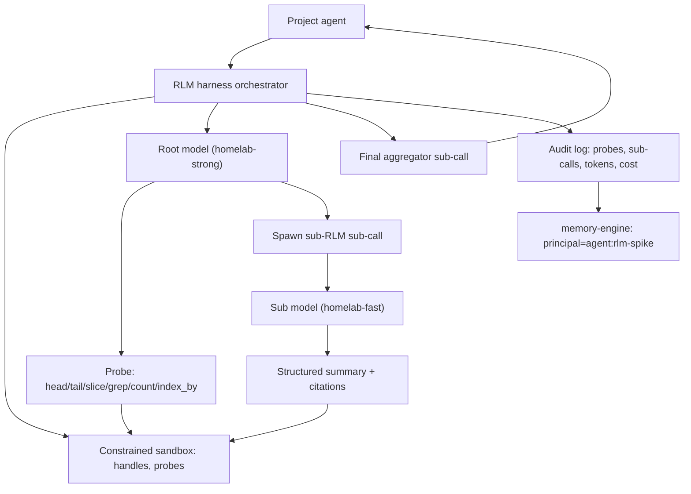

# RLM Harness

Specification for a small Recursive Language Model (RLM) harness used as a
research spike. This document defines the contract; the implementation lives
under `apps/_shared/rlm/` and the benchmarks under `apps/_shared/rlm/benchmarks/`.

The goal is not a production scaffold. The goal is a measurable substrate that
lets us decide whether to fold RLM-style routing into the project-agent stack.

## Why RLM here

Local models on the Alienware 3090 currently top out at 32K context. A growing
share of the agent platform's most useful tasks (multi-day incident review,
weekly executive review, cross-record memory aggregation) benefit from acting
over more material than fits cleanly in 32K. The video summary captured the
recursive language model paper's framing:

- the user prompt or large input lives as a symbolic handle in a sandbox, not
  as tokens in the root model's context
- the root model only sees constant-size metadata about each handle and
  decides what to inspect next via constrained probe code
- recursive sub-calls do dense local reasoning over slices and return only
  structured summaries; the sub-call's internal thinking is discarded
- the final answer is itself a sub-call so the root never holds the full
  synthesis

That property is independently useful for tool-output-heavy agents, not just
long-context tasks. The harness is the smallest substrate that lets us measure
both.

## Scope

In scope for this spike:

- a constrained, auditable harness usable from any project agent
- two homelab benchmark workflows (incident post-mortem, weekly review)
- comparison against direct and RAG baselines on the same prompts
- per-orchestration audit log (probes, sub-calls, tokens, latency, route)

Out of scope for this spike:

- arbitrary Python execution or a full persistent REPL
- cloud-frontier models (kept local so the cost shape is electricity-only)
- production rollout into any project agent path
- changing memory-engine query behavior

## Architecture



Key invariants the harness must enforce:

1. The user prompt or large input lives in the sandbox as a symbolic handle,
   not in root tokens.
2. The root only ever sees constant-size handle metadata.
3. Recursion is executed harness code, not a logged free-form tool action.
4. Sub-calls run in isolated context windows. Internal CoT is discarded; only
   the structured summary returns.
5. The final answer is produced by an aggregator sub-call. The root assembles
   intent, never the prose.

## Handle protocol

Every handle is created when the harness ingests a chunk of input that is too
large or too repeatedly used to belong in the root context.

Each handle carries:

- `id`: stable opaque string, for example `log-42`
- `kind`: one of `text`, `lines`, `json`, `records`, `pdf`, `transcript`
- `length`: total length in bytes, lines, or records depending on kind
- `schema`: short structural description, for example `lines: ISO timestamp + level + message`
- `prefix`: first 200 characters or first 5 records, never the whole thing
- `accessor`: which probe functions are valid for this kind
- `provenance`: caller-provided metadata: project, source_ref, intake_id

The metadata is what the root sees. The body lives only in the sandbox.

## Constrained probe vocabulary

Probes are not arbitrary code. The root issues calls from a fixed vocabulary
the harness parses, dispatches, and audits.

Read probes:

- `head(h, n)`
- `tail(h, n)`
- `slice(h, start, end)`
- `grep(h, pattern)` — returns line numbers and short snippets
- `count(h, pattern)`
- `index_by(h, key)` — for `records` and `json`
- `describe(h)` — recomputes metadata after a transformation

Reasoning probes:

- `summarize_via_subcall(h, range, prompt)` — dispatches a sub-call against the
  given slice with the given prompt, returns structured summary
- `aggregate_via_subcall([h1, h2, ...], prompt)` — dispatches a sub-call across
  multiple handles for stance aggregation
- `finalize(prompt)` — dispatches the final aggregator sub-call; this is the
  only path that returns the user-facing answer

Write probes:

- `note(handle_id, text)` — stash a short root-level note that survives
  iterations; counts toward the root context budget
- `derive(h, transform, name)` — produce a new handle from an existing one, for
  example `derive(log_42, "filter level=ERROR", err_log_42)`

Anything else is a constraint violation. The harness rejects unknown probes
and logs them as `policy_violation` events.

## Sub-call contract

Inputs to every sub-call:

- `sub_prompt`: the instruction
- `handle_slice`: a single handle plus an optional `(start, end)` range, or a
  list of handles for aggregation
- `intent`: symbolic intent that resolves to a route via the existing gateway
  shim (`summarize`, `classify`, `code`, `plan`)
- `cost_budget`: token + sub-call ceilings inherited from the harness

Outputs from every sub-call must be JSON-shaped:

```json
{
  "summary": "string under N words",
  "citations": [{"handle": "log-42", "range": [120, 142]}],
  "confidence": "low|medium|high",
  "open_questions": ["..."]
}
```

The harness rejects free-form output. Anything that doesn't parse into the
schema is treated as a sub-call failure, recorded, and retried at most once.

Sub-call internal CoT (the model's chain-of-thought) is discarded after the
structured object is parsed. Only `summary`, `citations`, `confidence`, and
`open_questions` are appended to root state.

## Cost ceilings

Every harness invocation declares a budget. Defaults come from the project
agent's routing policy.

- `max_root_tokens`: hard cap on the root model's running context
- `max_subcalls`: total number of sub-calls allowed per orchestration
- `max_total_tokens`: cap across root + sub-calls
- `max_wall_seconds`: end-to-end deadline
- `subcall_quality_floor`: confidence threshold below which the harness retries
  with `homelab-strong` for the sub-call

When any ceiling is hit, the harness aborts with a `budget_exhausted` reason
and returns whatever the last `finalize` call produced, plus the audit trail.

## Provenance and audit

Every probe and sub-call writes one audit event:

- `orchestration_id`: ULID per harness invocation
- `step`: monotonic integer per orchestration
- `kind`: `probe` or `subcall`
- `name`: probe or intent name
- `handle_ids`: which handles were touched
- `tokens_in`, `tokens_out`: per-call token counts
- `latency_ms`
- `route`: resolved gateway tier
- `model`: actual model name behind the route at call time
- `confidence` (sub-calls only)
- `result_summary`: short text recap

The audit trail is JSONL on disk and, optionally, ingested into memory-engine
under `principal=agent:rlm-spike` with `record_key=rlm.orchestration.<id>`.

## Routing integration

The harness uses the existing symbolic-intent shim from
[config/policies/executive-assistant-policy.yaml](../config/policies/executive-assistant-policy.yaml).
Sub-calls resolve `summarize` and `classify` to `local-fast` and `code` /
`plan` to `local-strong`. Cloud routes are never invoked in the spike.

The eventual integration (if the spike lands well) folds two new task classes
into the routing layer:

- `long_context_synthesis` — workflows that should default to RLM
- `tool_output_sandbox` — agent tool outputs above a threshold that should be
  handled as handles

Those are noted here and not added until the decision memo says so.

## Threat model

This is a research substrate. The constrained probe vocabulary plus
JSON-schema-only sub-call returns is the security boundary, not raw Python.
The harness must:

- never `eval` or `exec` model output
- treat handle bodies as data, not instructions
- run Shield scans on all incoming raw inputs before they become handles
- redact secrets in audit logs before write
- refuse handles whose `kind` does not match the declared accessor set

## Acceptance criteria for the spike

The harness is "good enough" if:

- it can run both benchmark workflows end-to-end on the Alienware host
- it produces structured audit trails matching the schema in this document
- the comparison harness can score its output against direct and RAG baselines
- the decision memo can be written from the resulting JSONL plus a small
  notebook

It is explicitly fine if RLM loses on one or both workflows. The spike is
designed to make that knowable.
