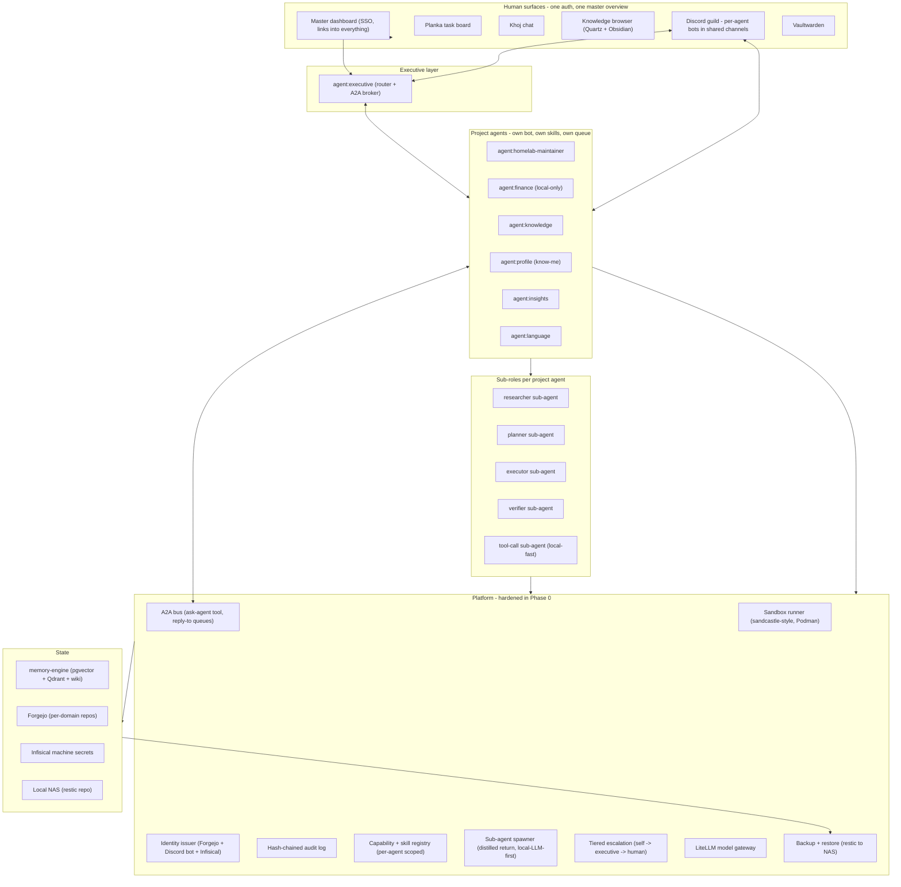
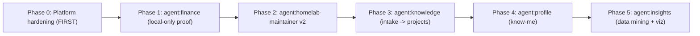

# Vision: Personal AI System

A security-first, mostly-local personal AI built on top of this repo and the
sibling `memory-engine` repo. The system already has identity, routing, audit,
review, and memory primitives in place; the vision is to finish the platform
chassis and ship five concrete domain agents on top of it.

This document is the durable narrative. Per-phase build plans live in
[docs/plans/](plans/).

## What already exists

- **Per-agent identity, scopes, routing, trust** — see [docs/PROJECT_AGENTS.md](PROJECT_AGENTS.md)
  and [docs/ACCESS_MATRIX.md](ACCESS_MATRIX.md). `agent:finance` is reserved as
  local-only; `homelab.*`, `finance.*`, `language.*`, `knowledge.*`, `intake.*`,
  and `trust.*` namespaces are reserved.
- **Smart model routing** via the LiteLLM gateway with symbolic intents
  (`local-fast`, `local-strong`, `cloud-frontier`). See
  [docs/STRONG_MODEL_STRATEGY.md](STRONG_MODEL_STRATEGY.md) and
  [docs/MODEL_OPTIMIZER_AGENT.md](MODEL_OPTIMIZER_AGENT.md).
- **Author + review pipeline driven by Planka columns**, with immutable trust +
  lifecycle JSONL streams. See [docs/AGENT_SERVICES.md](AGENT_SERVICES.md) and
  [docs/PR_WORKFLOW.md](PR_WORKFLOW.md).
- **Always-ready coordinator** — `agent:executive` with local web chat + Discord
  bridge. See [docs/EXECUTIVE_ASSISTANT.md](EXECUTIVE_ASSISTANT.md) and
  [docs/HUMAN_INTERFACES.md](HUMAN_INTERFACES.md).
- **Memory + retrieval** — `memory-engine` (Postgres+pgvector, Qdrant, Mem0,
  Khoj, n8n, hybrid wiki compiler) with provenance and contradiction scan.
- **Human/machine secret split** — Vaultwarden for humans, Infisical-class for
  machines. See [docs/SECRETS.md](SECRETS.md).
- **Shield** (prompt-injection + secret-leak gate) wired into `agent:executive`.

## Layered model

The platform is the kernel; project agents are the apps; the executive is the
launcher; humans interact through the surfaces they already know, with one
master dashboard tying everything together behind SSO.

## Domain agents (target end state)

- **`agent:finance`** — local-only. Beancount ledger + Fava browser.
  Categorization with verifier loop. TradingAgents-style debate (analyst /
  researcher / advisor / risk) for read-only advice. Mutations require CLI or
  master dashboard, never Discord.
- **`agent:homelab-maintainer` v2** — CVE/upgrade tracker against
  `inventory/services.yaml`, recommendation generator, install playbooks.
  Verifier loop required for `compose/` or `inventory/` changes.
- **`agent:knowledge`** — funnel: raw intake -> classify -> promote to project
  (Planka card or Forgejo repo). Shareable through Forgejo permissions and Khoj
  collections. Vault under Quartz + Obsidian.
- **`agent:profile`** — durable preferences, interaction style. `propose_only`
  autonomy. `profile.*` namespace. Consent-gated tool grants per surface.
- **`agent:insights`** — read-only across declared namespaces. Outputs to
  Grafana / Metabase boards. Weekly digest piped into the executive review.

## Cross-cutting principles

- **Default deny** on network, secrets, repos, namespaces, skills, tools, A2A
  callees, and Discord channels. Every grant is explicit and lives in
  [config/agents/](../config/agents/).
- One agent, one identity, one queue root, one memory principal, one Discord
  bot.
- Skills and tools are loaded per agent — never globally — so an agent's prompt
  only contains what its job requires.
- Inter-agent calls go through the audited A2A bus; no agent has implicit
  privilege over another.
- Sub-agent for tool calls by default: parent context stays small; `local-fast`
  is the default route; transcripts go to the audit log, distilled return goes
  to the parent.
- **Planka updates are comments, not description rewrites.** The card
  description is the durable spec; every update is a card comment attributed
  to the agent that made it.
- **Sensitive agents (`agent:finance`, `agent:profile`) are read-only from
  Discord.** Mutations require CLI or master-dashboard origin and are enforced
  by the bridge, not by trusting the agent.
- Every cloud-bound call is logged and reviewable; every local-only namespace
  can prove no cloud route exists.
- Every action a human disagrees with becomes a demotion event in the trust
  ledger; every two consecutive low-risk wins becomes a promotion candidate.
- All human surfaces sit behind one SSO (Authentik). No `?token=...` URLs in
  production.
- Every piece of state has a backup class and a place in the restore runbook.

## Patterns adopted from external projects

- **sandcastle** (`mattpocock/sandcastle`) — typed `run({ agent, sandbox,
  branchStrategy })` API around rootless Podman; standard sandbox runner for
  any agent that runs code. See Phase 0.1.
- **the-verifier-agent** (`disler/the-verifier-agent`) — first-class verifier
  loop for high-risk actions. Read-only re-check, separate process, can only
  call `verifier_prompt` back to the builder. Hard cap 3 loops, then human
  escalation. See Phase 0.4.
- **TradingAgents** (`TauricResearch/TradingAgents`) — multi-role debate
  template for `agent:finance`. Implementation lives inside one project agent,
  not at the platform.
- **ResonantOS** (`ResonantOS/resonantos-vnext`) — capability registry pattern:
  each agent manifest declares capabilities and shared/private providers; the
  platform enforces. See [config/agents/](../config/agents/).
- **manifest** (`mnfst/manifest`) — replaced by the existing LiteLLM gateway;
  only adopt their per-call cost/latency log. See Phase 0.6.
- **thepopebot** (`stephengpope/thepopebot`) — pattern reuse only: in-browser
  terminal attached to the maintainer agent's live workspace, behind the
  dashboard. Not adopted as-is.
- **Hermes "always learning"** — the existing weekly review + trust ledger plus
  the new `profile.*` namespace are the visible learning surface.

## Sequencing

Phase 0 is detailed in [docs/plans/phase-0-platform.md](plans/phase-0-platform.md).
Each subsequent phase becomes its own plan when work begins.

## Out of scope

- Live trading. TradingAgents is adopted as a debate pattern only; finance is
  read-only / advisory.
- Replacing the LiteLLM gateway with manifest. Already covered.
- A new desktop shell. Planka + Khoj + Discord + master dashboard is the shell.
- Mobile apps. Discord on phone is the mobile interface.
